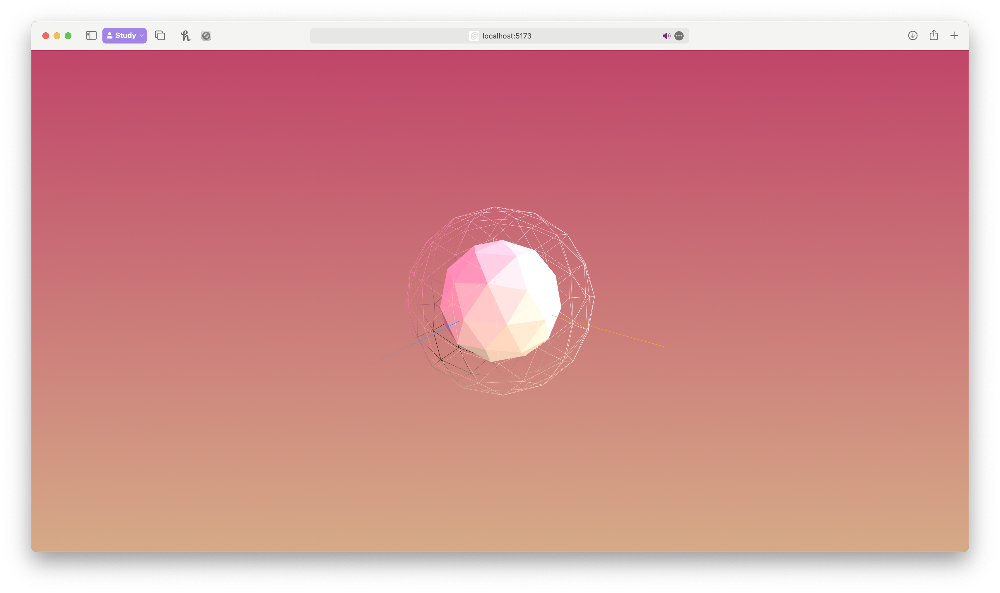

# Three.js Gradient Mesh

This is an experiment using `three.js` built-in meshes and light settings with `lil-gui` debug tools.

## Preview



## Installation and Usage

```bash
pnpm install
pnpm dev
```

## Languages and Tools:
<a href="https://developer.mozilla.org/en-US/docs/Web/JavaScript" target="_blank" rel="noreferrer"> 
   
</a> 
<a href="https://www.typescriptlang.org/" target="_blank" rel="noreferrer"> 
   
</a>
<a href="https://www.typescriptlang.org/" target="_blank" rel="noreferrer"> 
  
</a>


## Credits

Gradient Maker – https://coolors.co/gradient-maker/ba3429-9243a9

## License

[MIT](https://choosealicense.com/licenses/mit/)
